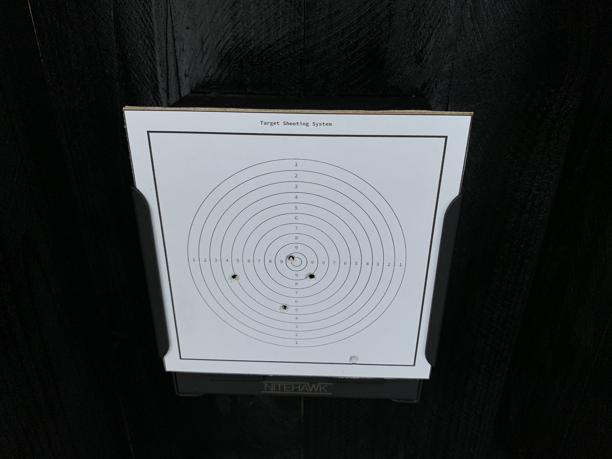

# target-scores

Run program

```
cd build
./main
```

## Stage 1: Align Image taken from the camera

- `ImageAlignment.hpp`
- `ImageAlignment.cpp`

Input images:

1. Image taken 

    

2. Reference target board imge

    

### Extract matching features
```
matches.size() = 500
```


Obtain good matching points with the ratio test
```
good_matches.size() = 38
```


### Warp Perspective


## Stage 2: Detecting information from the target board

- `ShootingScore.hpp`
- `ShootingScore.cpp`

Output: 

