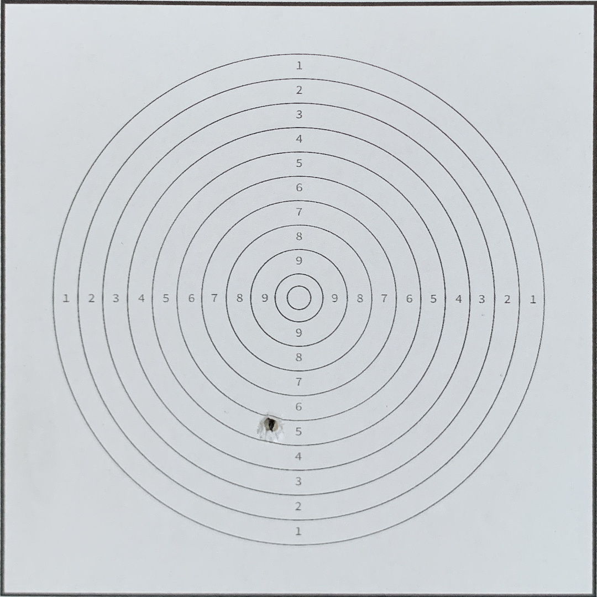
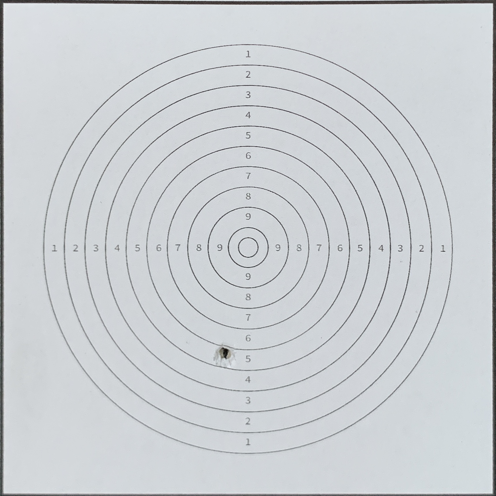

# target-scores

Device & Environment requirements have been specified in `CMakeList.txt`.

Build program
```
mkdir build && cd build
cmake ..
make
```

Run program

```
./main
```

## Stage 1: Align Image taken from the camera

- `ImageAlignment.hpp`
- `ImageAlignment.cpp`

Input images:

|      Image taken       |     Reference target board     |
| :--------------------: | :----------------------------: |
|  |  |

### Extract matching features
|          Matches          |          Good Matches          |
| :-----------------------: | :----------------------------: |
|  `matches.size() = 500`   |   `good_matches.size() = 38`   |
|  |  |


### Warp Perspective

After the warpping, the output is given as below.



## Stage 2: Detecting information from the target board

- `ShootingScore.hpp`
- `ShootingScore.cpp`

Output: 

